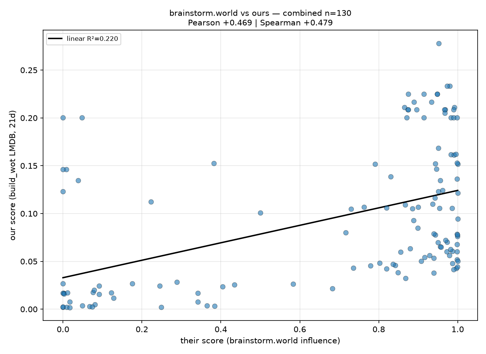

# build_wot

Builds a Nostr [web of trust](https://github.com/nostr-protocol/nostr) from contact lists
(kind 3) and stores trust scores in LMDB for fast lookup by write policies, feeds, and
spam filters.

It connects to relays, crawls contact lists, propagates trust from a set of root
accounts, and writes one float score per pubkey into an LMDB database. Relay set is
auto-expanded by reading kind 10002 (NIP-65) relay lists of trusted accounts.

## How trust is computed

1. **Graph**: for each author, only the newest kind 3 event counts; its `p` tags are the
   exact current follow set. Unfollows therefore take effect (older contact lists are
   never mixed in).
2. **Propagation**: a root account `r` with weight `w(r)` gives every account it follows
   `w(r) * decay`, and so on per hop, always keeping the *maximum* per account:
   `t(u) = max(t(u), decay * t(v))` over all `v` following `u`. Computed exactly with a
   max-heap (Dijkstra-style), so the result is independent of event arrival order.
3. **Score**: for an account `u` with at least one trusted follower, its score is

   ```
   score(u) = decay * (sum of top-10 weights) / 10
   weight(v) = t(v) / len(follows(v))^0.3    if len(follows(v)) > 20
   weight(v) = t(v)                           otherwise
   ```

   The hub penalty damps accounts that follow thousands of people (follow-for-follow,
   spam rings). Accounts with no trusted followers get no entry.

All constants (`decay`, `top_n`, `hub_min_follows`, `hub_exponent`, root weights) live in
the config file.

## Install

```sh
python -m venv .venv
.venv/bin/pip install -r requirements.txt
cp wot.toml.example wot.toml
# edit wot.toml: roots and seed relays
```

Requires Python 3.11+ (uses `tomllib`).

Run tests with:

```sh
.venv/bin/python -m unittest discover -s tests
```

## Run

```sh
.venv/bin/python build_wot.py                # batch crawl, then stay live
.venv/bin/python build_wot.py --once         # batch crawl, score, write, exit (cron-friendly)
.venv/bin/python build_wot.py --dump wot-db  # inspect a store
```

Batch mode crawls the configured `history_days` window of contact lists across all
relays concurrently, scores, and writes the store. In live mode it stays connected,
applies new contact lists as they arrive, and recomputes affected scores every
`recompute_interval_s`. Live updates are monotone (trust only grows); trust decreases
from unfollows take effect on the next batch run.

### Run always

With `batch_refresh_s > 0` (e.g. 21600 = 6h) the running process re-runs the full batch
crawl periodically, so unfollows and trust decreases apply without restarting. To keep
it running across reboots and crashes, use a systemd user service:

```sh
mkdir -p ~/.config/systemd/user
cp build_wot.service ~/.config/systemd/user/
# edit ExecStart/WorkingDirectory in the unit if the repo lives elsewhere
systemctl --user daemon-reload
systemctl --user enable --now build_wot
loginctl enable-linger        # keep it running after logout / at boot
journalctl --user -u build_wot -f
```

## Config

```toml
[relays]
seed = ["wss://nos.lol", ...]  # starting relays
blacklist = []                 # never connect, never auto-discover
insecure = []                  # relays with broken TLS certs (verification skipped)
max_relays = 50                # cap including discovered relays
discover = true                # expand relay set via kind 10002 of trusted accounts
discover_top = 1000            # fetch 10002 for roots + top-N trusted accounts

[roots]
"npub1..." = 0.8               # bech32 npub or hex pubkey = seed weight (0 < w <= 1)

[crawl]
history_days = 21              # window; larger = deeper web of trust, longer crawl
page_limit = 500
batch_timeout_s = 3600.0
eose_timeout_s = 60.0
max_attempts = 5

[trust]
decay = 0.7
top_n = 10
hub_min_follows = 20
hub_exponent = 0.3

[storage]
lmdb_path = "wot-db"
map_size_gb = 10.0

[live]
recompute_interval_s = 300.0
```

## Storage format

LMDB environment with a single database named `tru`:

- key: 32-byte pubkey
- value: 32-bit float (native byte order) score in (0, 1]

Scores are relative to the configured roots and window; they are not portable between
root sets.

## Design notes

- Only kind 3 and 10002 are used. The relay set grows from the roots' own relay lists
  instead of counting deprecated relay hints inside kind 3 content.
- Duplicate events seen across relays are processed once.
- Malformed events (bad pubkeys, timestamps in the future) are skipped.
- Each relay reconnects independently with exponential backoff; a relay that rejects the
  request is marked failed for the run and does not block scoring.

## Comparison with brainstorm.world

Our 21-day store vs [brainstorm.world](https://brainstorm.world) influence scores over 130
shared pubkeys:



Pearson +0.47 / Spearman +0.47: 
the scores generally agree, but some disagreement is always good for decentralization.

## License

MIT
